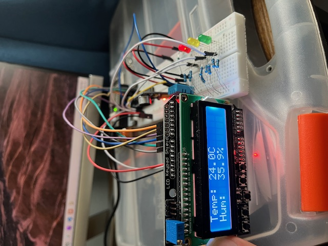

# Desk Environment Monitor

A real-time desk environment monitor built with an ESP32 and FreeRTOS. Tracks temperature, humidity, and noise level, displays readings on a 16x2 LCD, and provides environment status via LEDs.

---

## Features

- Real-time temperature and humidity readings with DHT11
- Noise level monitoring via analog sound sensor
- 16x2 LCD display with screen switching using buttons
- LED alert system based on set thresholds
- Concurrent FreeRTOS task architecture with queue-based inter-task communication
- Custom LCD driver written from scratch in 4-bit mode
- Custom DHT11 1-wire bit-bang driver

---

## Hardware

| Component | Description |
|---|---|
| ESP32 WROVER DevKit | Main microcontroller |
| LCD Keypad Shield | 16x2 HD44780 LCD + 5 buttons |
| DHT11 | Temperature and humidity sensor |
| Sound Sensor V2 | Analog noise sensor |
| LED x3 (Red, Yellow, Green) | Alert indicators |
| Resistors (330Ω x3, 10kΩ x1) | LED current limiting, DHT11 pull-up |

---

## Firmware Architecture

The firmware is structured as four FreeRTOS tasks communicating through a single shared queue holding the latest `env_data_t` struct.

```
sensor_task   -- reads DHT11 every 2s, writes temp/humidity to queue
audio_task    -- samples sound sensor every 200ms, updates noise level in queue
display_task  -- reads queue every 100ms, updates LCD based on active screen
alert_task    -- reads queue every 500ms, drives LEDs based on thresholds
```

### Alert Thresholds

| Condition | LED |
|---|---|
| Temp > 32°C or Noise > 2500 | Red |
| Temp > 28°C or Noise > 1500 | Yellow |
| Normal | Green |

### Button Mapping

| Button | Action |
|---|---|
| RIGHT | Switch to noise screen |
| LEFT | Switch to temp/humidity screen |

---

## Project Structure

```
desk-monitor/
├── main/
│   ├── CMakeLists.txt
│   ├── main.c        -- app_main, task definitions
│   ├── lcd.c/h       -- HD44780 driver (4-bit parallel mode)
│   ├── dht11.c/h     -- DHT11 1-wire bit-bang driver
│   ├── sound.c/h     -- ADC sound level averaging
│   ├── alerts.c/h    -- LED threshold alert logic
│   └── buttons.c/h   -- Resistor ladder button reading
└── CMakeLists.txt
```

